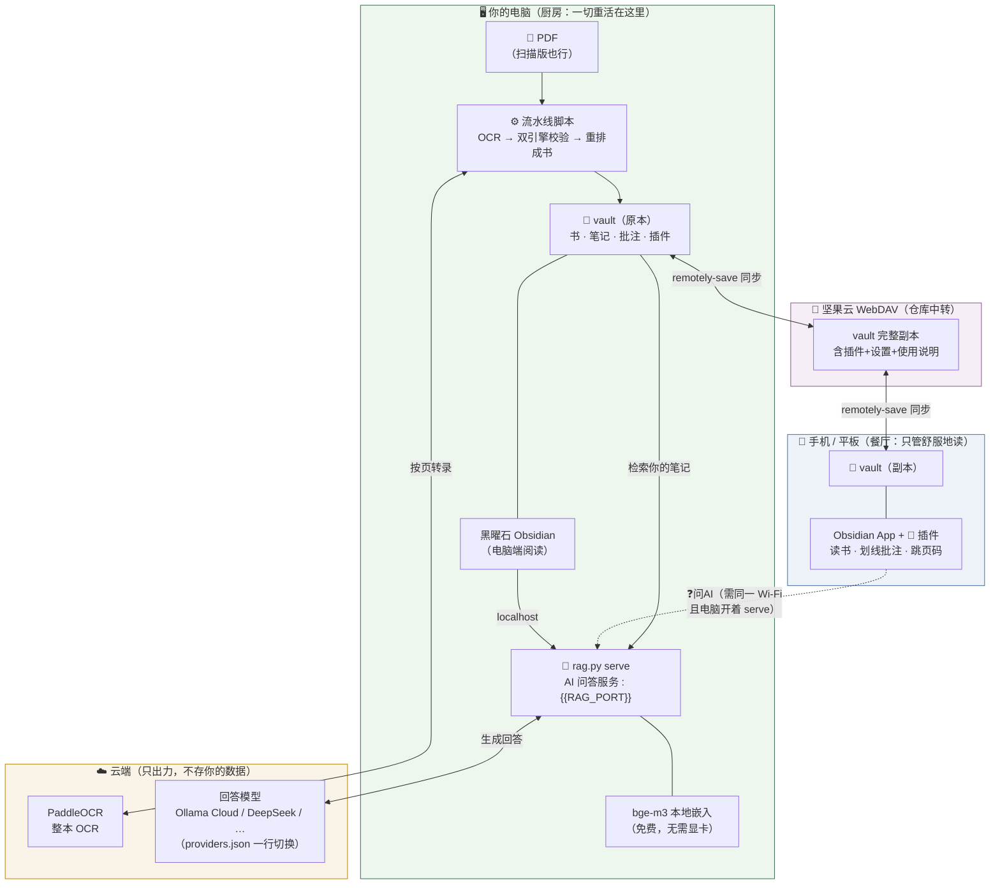

# 🗺️ 系统架构 — 一张图看懂

![[系统架构图.svg]]

文字版（mermaid）

## 谁在什么时候可用

| 功能 | 手机（任何时候） | 手机（家里 Wi-Fi + 电脑开机） | 电脑 |
|---|:---:|:---:|:---:|
| 读书、跳页、看批注 | ✅ | ✅ | ✅ |
| ✍️ 划线批注 | ✅（同步后各处可见） | ✅ | ✅ |
| ❓ 问 AI | ❌ | ✅ | ✅ |
| 导入新书（OCR 流水线） | ❌ | ❌ | ✅ |

## 三条关键线，记住就够了

1. **书从哪来**：PDF 进电脑 → 流水线做成阅读版 → 存进 vault
2. **怎么到手机**：vault ⇄ 坚果云 ⇄ 手机（插件和说明书都在包裹里）
3. **AI 靠什么**：手机上的问题 → Wi-Fi → 电脑上的 rag.py serve → 检索你的笔记 + 云端大模型作答

> 配置步骤见 [[同步设置]]；日常操作见 [[使用说明]]。
